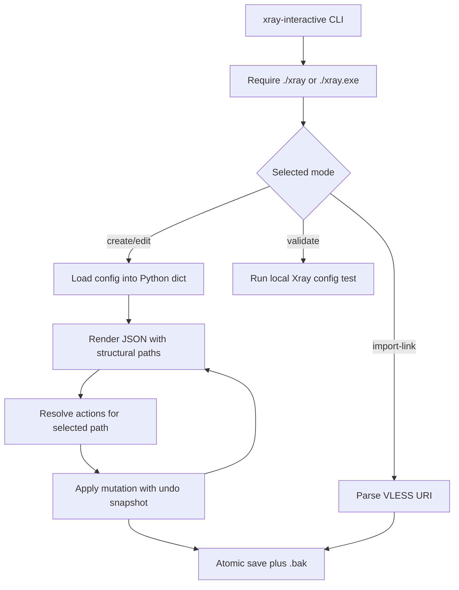

# xray-interactive

`xray-interactive` is a context-aware terminal editor for creating and changing
[Xray-core](https://github.com/XTLS/Xray-core) JSON configurations.

It displays the config as structured JSON, highlights the JSON container under
the cursor, and offers schema-aware actions for that container. The project is
currently focused on `inbounds`, `outbounds`, and `routing`, with guided support
for VLESS, Tunnel, SOCKS, HTTP, XHTTP, and REALITY.

> [!IMPORTANT]
> `xray-interactive` only works when the current working directory contains an
> Xray-core binary named `xray` or `xray.exe`. This is a deliberate project
> invariant: the program never searches `PATH` for Xray.

## Quick context for maintainers and AI coding agents

Read this section before changing the code.

1. `xray_interactive/cli.py` is the entry point and command dispatcher.
2. `xray_interactive/model.py` owns JSON creation, traversal, mutation, and
   atomic persistence.
3. `xray_interactive/render.py` converts JSON into terminal lines carrying
   structural JSON paths. It also lays out the wrapping action picker.
4. `xray_interactive/schema.py` is the declarative guided-editing layer:
   field specifications, context actions, and object templates live here.
5. `xray_interactive/tui.py` owns curses interaction and executes actions. Keep
   schema selection in `schema.py`; only put imperative mutations in `tui.py`.
6. `xray_interactive/importer.py` parses VLESS share links into outbound JSON.
7. `xray_interactive/xray.py` is the only layer that invokes the local Xray
   binary.
8. The guided schema is not an independent Xray validator. Xray itself remains
   the source of truth through `xray run -test -config ...`.
9. Unknown configuration areas must remain editable through custom JSON actions
   and raw block editing. Do not reject valid future Xray fields merely because
   they are absent from the guided schema.
10. Preserve atomic writes and `.bak` behavior when changing persistence.

The most important data type is `JsonPath`, a tuple of object keys and array
indexes. Examples:

```python
()                                      # config root
("inbounds",)                           # all inbounds
("inbounds", 0)                         # one inbound
("inbounds", 0, "settings", "users")   # its users array
```

The cursor does not directly select text. Every rendered line has a
`container_path` and, where applicable, a `value_path`. The selected container
controls both highlighting and the actions shown at the bottom of the terminal.

## Repository map

| Path | Responsibility | Change this when... |
| --- | --- | --- |
| `xray_interactive/cli.py` | Arguments and top-level command flow | Adding a CLI command or flag |
| `xray_interactive/model.py` | Config template, JSON paths, load/save, tags | Changing persistence or generic JSON behavior |
| `xray_interactive/render.py` | Structural JSON rendering and action wrapping | Changing what is highlighted or how footer actions wrap |
| `xray_interactive/schema.py` | Field specs, context actions, templates | Adding a protocol, setting, or guided action |
| `xray_interactive/tui.py` | Keyboard input, prompts, mutations, undo/redo | Adding interaction or a new imperative action operation |
| `xray_interactive/importer.py` | VLESS URI parsing and mapping | Supporting another share-link field or scheme |
| `xray_interactive/xray.py` | Binary discovery and subprocess calls | Adding an Xray-backed operation |
| `tests/test_model.py` | Core model and local-binary invariant | Changing generic config behavior |
| `tests/test_schema.py` | Protocol templates and guided schema | Adding or changing supported config entities |
| `tests/test_importer.py` | Share-link mapping | Changing link import behavior |
| `tests/test_tui.py` | Pure TUI layout behavior | Changing action picker layout |

## Runtime flow



## Project invariants

### Local Xray binary

`find_xray_binary()` accepts only these paths:

```text
<current directory>/xray
<current directory>/xray.exe
```

Do not replace this with `shutil.which()` or an implicit `PATH` lookup. UUID
generation, version reporting, and config validation must use this exact binary
and run with its directory as the subprocess working directory.

### JSON-first editing

Prompt input is parsed as JSON when possible:

```text
443                 -> integer
true                -> boolean
["http", "tls"]     -> array
{"enabled": true}   -> object
example.com         -> unquoted string
```

The config root must remain a JSON object. Existing configs may contain fields
outside the current guided scope, and those fields must be preserved.

### Persistence

`save_config()` writes through a temporary file followed by `os.replace()`.
When replacing an existing config, it copies the previous saved version to
`<config name>.bak`. Changes to save behavior must keep interruption-safe writes
and the one-file backup unless the project explicitly changes this contract.

### Guided schema versus validation

`actions_for(config, path)` suggests valid-looking fields based on context, but
it does not prove that the resulting config is complete or accepted by a
particular Xray version. The `t` key and `--validate` delegate validation to the
local binary.

## Supported guided configuration

The current guided scope is intentionally narrower than the complete Xray
schema.

### Top level

`--create-config` creates all high-level entities represented by
`TOP_LEVEL_TEMPLATE`, including `routing`, `inbounds`, and `outbounds`.

### Inbounds

- VLESS, including users and UUID generation through `xray uuid`
- Tunnel (`protocol: "tunnel"`, formerly dokodemo-door)
- SOCKS, including authentication users and UDP settings
- HTTP, including Basic Authentication users and transparent mode
- Common inbound fields such as `listen`, `port`, `settings`,
  `streamSettings`, `tag`, and `sniffing`

SOCKS and HTTP default to `127.0.0.1` because neither protocol encrypts proxy
traffic and their primary intended use here is a local proxy.

### Outbounds

- VLESS outbound creation
- VLESS share-link import
- XHTTP transport settings
- REALITY client settings

### Routing

- Routing object fields
- Rule creation
- Guided routing rule fields

### Escape hatches

For unsupported or newly introduced Xray fields, use:

- `+ custom key` for an object;
- `+ JSON item` for an array;
- `E` to replace the selected block through `$EDITOR`.

These escape hatches are part of the compatibility strategy, not temporary
debug features.

## How the TUI works

`render_json()` produces `RenderLine` records instead of plain strings:

```python
@dataclass
class RenderLine:
    text: str
    container_path: JsonPath
    value_path: JsonPath | None = None
```

Selection behavior follows container nesting:

- Outside child blocks, the root object is selected.
- On the `inbounds` array, all inbounds are selected.
- Inside one inbound, that inbound object is selected.
- Inside `settings`, `streamSettings`, `xhttpSettings`, or
  `realitySettings`, the corresponding deeper object is selected.

`actions_for()` receives the selected path and returns `Action` objects. The
action picker is recalculated on every draw. `[` and `]` or `Ctrl+Left` and
`Ctrl+Right` change `action_index`; `Enter` calls `Editor.apply_action()`.

The picker is intentionally multiline. `layout_action_lines()` wraps complete
action labels and keeps the selected action visible when the terminal is too
short to show every row.

### Action operations

Most actions use one of these operation names:

| Operation | Behavior |
| --- | --- |
| `append_template` | Append a template from `template_for()` to an array |
| `set_field` | Prompt for and add a missing object field |
| `jump` | Move selection to another JSON path |
| `use_xhttp` | Set the transport method and create `xhttpSettings` |
| `enable_reality` | Set security and create context-specific REALITY settings |
| `generate_uuid` | Call the local Xray binary and place the returned UUID |
| `append_json` | Prompt for a raw JSON array item |
| `custom_key` | Prompt for an arbitrary object key and value |

If a new feature can be represented by an existing operation, add only schema
and template data. Add a new `apply_action()` branch only when new imperative
behavior is actually required.

## Extending the guided schema

### Add an inbound protocol

1. Add protocol settings specifications near the other `*_SETTINGS` constants
   in `schema.py`.
2. Add an action under the `("inbounds",)` branch in `actions_for()`.
3. Add protocol-specific `settings` routing in `actions_for()`.
4. Add a complete starter object to `template_for()`.
5. Add nested collection actions, such as user templates, when required.
6. Reuse an existing action operation when possible.
7. Add template and contextual-action tests to `tests/test_schema.py`.
8. Confirm the generated JSON with a real local Xray binary.

### Add a share-link field

1. Parse and normalize the field in `parse_vless_link()`.
2. Map it into the correct Xray JSON object.
3. Add the query key to `consumed`; otherwise the importer will correctly
   report it as unmapped.
4. Keep malformed optional values as warnings when safe; reject links missing
   required connection data.
5. Add a focused test to `tests/test_importer.py`.

### Add a new action operation

1. Define the action in `schema.py`.
2. Implement the operation in `Editor.apply_action()`.
3. Call `self.mutate()` before changing config data so undo/redo and dirty state
   remain correct.
4. Return the best path to select after the mutation.
5. Set a concise user-visible status message.

## Installation

Python 3.10 or newer is required. Windows installs `windows-curses`
automatically through the platform-specific dependency in `pyproject.toml`.

From the repository:

```bash
python -m pip install -e .
```

On Unix-like systems, the source launcher may also be used directly:

```bash
chmod +x xray-interactive
```

The runtime directory should look like this:

```text
runtime-directory/
├── xray                 # xray.exe on Windows
└── config.json          # created by the tool or supplied by the user
```

If installed with pip or pipx, the `xray-interactive` launcher may live
elsewhere. The shell's current directory must still contain the Xray binary.

## CLI commands

Create `config.json` and open the editor:

```bash
xray-interactive --create-config
```

Open an existing config (`--edit-config` is also the default mode):

```bash
xray-interactive --edit-config
xray-interactive
```

Import a VLESS outbound:

```bash
xray-interactive --import-link 'vless://...'
```

Import and immediately edit:

```bash
xray-interactive --import-link 'vless://...' --edit-after-import
```

Validate using the local Xray binary:

```bash
xray-interactive --validate
```

Show the local binary version:

```bash
xray-interactive --xray-version
```

Use another config filename:

```bash
xray-interactive --edit-config --config client.json
```

`--create-config` refuses to overwrite an existing file unless `--force` is
provided.

## TUI keys

| Key | Action |
| --- | --- |
| `Up` / `Down`, `k` / `j` | Move through rendered JSON |
| `PgUp` / `PgDn` | Move one terminal page |
| `Ctrl+Left` / `Ctrl+Right or square-brackets` | Select a context action |
| `[` / `]` | Portable fallback for selecting a context action |
| `Ctrl+Up` | Select the parent JSON container |
| `Enter` | Apply the selected action |
| `e` | Edit the scalar on the current line |
| `E` | Replace the selected block using `$EDITOR` |
| `d` | Delete the current value, block, or item |
| `u` / `Ctrl+R` | Undo / redo |
| `s` | Save atomically and update the backup |
| `t` | Save and validate through local Xray |
| `?` | Show help |
| `q` / `Esc` | Quit, confirming if changes are unsaved |

Some curses builds do not expose `curses.define_key()`. The editor therefore
also decodes common xterm-compatible Ctrl+Arrow escape sequences itself.

## VLESS import mapping

The importer currently maps:

- `type=tcp` or `type=raw` to `streamSettings.method = "raw"`;
- `type=xhttp` or `type=splithttp` to `method = "xhttp"`;
- `security=reality` to REALITY client settings;
- `sni`, `fp`, `pbk`/`publicKey`/`password`, `sid`, `spx`, and `pqv`;
- XHTTP `host`, `path`, `mode`, and JSON-object `extra`;
- VLESS `encryption` and `flow`.

Unknown query parameters are not injected into config JSON. They are returned
as warnings so the user can review unsupported link data.

## Development and tests

Run the complete test suite from the repository root:

```bash
python -m unittest discover -v
```

The tests do not require a real Xray installation. The binary-discovery test
creates a temporary executable. Manual validation of generated configuration
still requires a compatible local Xray binary.

Before submitting a change:

1. Run all tests.
2. Add tests at the layer where behavior changed.
3. Check that unsupported JSON still round-trips without data loss.
4. Check undo/redo for new TUI mutations.
5. Check action wrapping at a narrow terminal width.
6. Validate generated config with a real Xray binary when schema output changes.

## Current non-goals

- Searching the operating system `PATH` for Xray
- Reimplementing the complete Xray validation rules in Python
- Hiding or deleting unknown Xray configuration fields
- Supporting every inbound, outbound, or transport protocol in the guided UI
- Treating `tunnel` and `tun` as the same protocol

`tunnel` is the port-mapping/transparent-proxy inbound formerly known as
dokodemo-door. Xray's `tun` protocol creates a TUN interface and is not currently
part of the guided schema.

## Upstream configuration references

- [Top-level configuration](https://xtls.github.io/en/config/)
- [Inbound object](https://xtls.github.io/en/config/inbound.html)
- [Outbound object](https://xtls.github.io/en/config/outbound.html)
- [Routing](https://xtls.github.io/en/config/routing.html)
- [VLESS inbound](https://xtls.github.io/en/config/inbounds/vless.html)
- [Tunnel inbound](https://xtls.github.io/en/config/inbounds/tunnel.html)
- [SOCKS inbound](https://xtls.github.io/en/config/inbounds/socks.html)
- [HTTP inbound](https://xtls.github.io/en/config/inbounds/http.html)
- [Transport configuration](https://xtls.github.io/en/config/transport.html)
- [REALITY](https://xtls.github.io/en/config/transports/reality.html)
- [XHTTP discussion and reference](https://github.com/XTLS/Xray-core/discussions/4113)

When documentation and a local Xray build disagree, use the target Xray
version's validation output as the final compatibility check.
